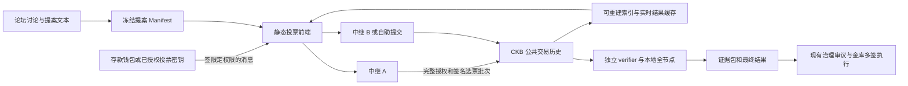

# 设计与方案选择

设计基线 v0.3，2026-10-08。用户已选择以本方案为基础，吸收 Fable（Claude）设计中有价值的部分。本轮已作出的工程选择与仍需治理/PoC 确认的边界见 [修订与决策记录](09-design-update.md)；按实际操作阅读见 [完整用户流程](10-user-journey.md)。

## 1. 建议

把 Omavote 做成一个用途窄、协议公开的投票器：**保留 Nervos Talk 讨论，保留 Nervos DAO 本金票权，保留现有金库执行流程；重新实现选票授权、提交、计票与验证。**

推荐默认路线：钱包签署只对一个提案有效的选票 → 中继帮助批量上链 → 任何节点观察者独立计票 → 公布完整可重算结果。中继可以有运营团队，也可以由社区运行。投票者不需要把 Nervos DAO 存款转交给它。

本轮吸收：钱包直接签署含标题、预算、收款方和选择的可读票面；论坛提案导入与参数核对；多地址逐项引导；公开查询 API 与订阅通知；依据实际钱包/存款分布组织迁移和验收。仍以完整选票上链、按签入锚点排序、独立 verifier 为主干。期限型投票授权进入首版，默认一年（365 链日）、最长 365 天；任意治理规则引擎不进入首版；格式 marker 脚本保留为实测后可选的载体优化。

它的保证是“伪造不了你的有效签名；已及时上链的有效票能从公共链重建；结果可独立发现错误”。它不承诺矿工绝不审查、用户设备永不失窃、巨鲸不能合法影响结果，也不承诺合约自动执行结果。

这一选择适合本任务的原因：投票频率和参与规模有限，正确授权和公开证据比高吞吐更重要；金库已经需要治理执行，不必为了可复算额外引入本金托管合约；签名加中继把链费与周转容量留给运营方；用户免费投票为硬约束，故障出口优先由备用中继或帮助者代付。

## 2. 四条路线

| 路线 | 用户动作 | 有效票的数据源 | 主要信任 | 优点 | 主要代价 |
|---|---|---|---|---|---|
| A：链下签名、公开日志 | 签一条消息 | 中继公开日志、完整导出、多方留存 | 收票完整性、截止时间见证、持久保存 | 最轻；用户可零手续费 | 有签名但未被接收的票难客观判断及时性；需明确可信运营 |
| **B：签名选票、链上完整存证** | 通常签消息；中继代付 | 链上历史中的完整选票及签名 | CKB 共识、验证程序、可获得的历史数据；中继影响及时性 | 数据和截止位置可重建；换中继不换规则；不碰本金 | 每批有手续费；临近截止需要上链等待；独立审计需要历史数据 |
| C：CKB 交易直接投票 | 每次签交易 | 交易 input 授权、选票 output / witness | 已支持 lock 的授权语义、链、计票程序 | 不需单独消息签名标准，部分钱包容易复用 | DAO-only 地址需要普通 cell；资金选择错误风险；不是所有 lock 都能泛化 |
| D：合约状态/zkVM 验证结果 | 通常交易或签名中继 | 合约状态或历史证明 | 合约/guest/verifier 正确性与链；证明生成可用性 | 可以走向无需人工信任的链上结算 | 审计面和维护成本最大；资金自动执行放大错误后果 |

B 与 C 可以共享计票语义，但 **第一版不应同时承诺所有授权路径**。先完成 B 的 secp256k1/常见 EVM 消息签名路径；C 作为无消息签名钱包的后续 adapter。若 PoC 证明 B 的核心钱包体验不可接受，C 可成为某类钱包的首选，而不是为统一界面强行要求用户迁移存款。

若时间或预算只允许 A，可以诚实交付 A：保留签名、receipt、开放导出和复算，并公开承认运营者仍能影响接收集合。不能把 A 的结果哈希偶尔上链，宣传成 B 的完整保证。

当前用户已选择以 B 推进；A 是将来预算或约束变化时需要重新明确选择的备选，不是实施团队可以静默切换的降级。B 故障时应切换中继/代发路径，不能把未上链的服务器日志临时变成正式选票。

## 3. 为什么 B 不需要一个新投票合约

CKB 可以承载任意交易数据。选票是一个由资产控制者或其明确授权投票密钥签署的协议消息，验证程序从公共交易历史读取并判断它是否有效。承载它的交易由中继支付，链共识保证交易数据的承诺和收录顺序，投票有效性由开源程序判断。

这样链上也可能出现垃圾或无效选票，计票器必须拒绝它们。无效载荷上链不会自动获得票权。中继签名不代表选民签名，也不决定选民资格。基础协议没有合约里可供管理员更新的“合格选民根”。

首版 V2 草案的载体可以是普通 cell 中的短索引头与数据哈希，完整选票批次放在该交易 witness 中。短索引头承诺 witness 的内容；审计器必须验证两者一致。花掉载体 cell 只回收中继的存储容量，不删除历史，也不撤回其中的选票。细节见 [协议草案](03-protocol.md)。

这是可审计链下计票协议，不是链共识直接执行的治理结果。未来要自动拨款，需要另一个经过审计的执行层，不能把数据库的 `passed=true` 直接接到金库。

此前评审中提出的最小 marker type script 只约束数据格式，方便索引器发现载体；它与托管本金或自动付款的合约是不同用途。本版仍默认普通 carrier；若 PoC 证明 marker 明显改善扫描/恢复成本，可以在首个正式版本冻结前选用，但完整签名票和独立重放要求不变，不新增管理员决定票权的权限。

## 4. 把身份与票权分开

票权主体是完整的 CKB lock script：`code_hash + hash_type + args`。`owner_id` 是该 script 的标准 CKB hash。短地址、长地址、不同钱包中同一 script 的显示形式，都归一到同一主体。

本金单位是 DAO deposit outpoint：`tx_hash + output_index`。一个 outpoint 在一个最终状态下只归属一个 lock；同一 lock 在一个提案里只有一个最终有效选择。网站账号、昵称、邮箱、DID、浏览器设备都不能增加票权。

界面允许“我的多个地址”本地分组；每个 lock 都单独证明控制权。相同 key 管理 Omnilock 与 PW Lock 时，经过审查的 adapter 可以协助批量准备控制消息，但每份授权只对应一个明确的 owner script，分别验权；不能只根据相同 args 尾部猜测并自动累加。

首版支持每个存款地址一次授权同一在线钱包的投票 key，期限内由该钱包为各地址分别签本提案的选择。十个地址仍是十个计权主体，网页可以合并引导，实际签名弹窗次数按钱包验收结果说明，不承诺十张票只需一次钱包确认；不再每个提案去 Neuron 重复操作。同地址十笔 deposit 仍只对应一张票。地址清单不是授权，公开的 owner 签名控制消息才是。直接票路径继续保留。

第一版不要求网站账号、绑定论坛账号或注册 DID。Neuron 用户的主流程是授权第二个已验收的在线钱包，由钱包保管投票 key；连接钱包便于日常使用，但每一票仍须签署具体提案与选择。网页不接收 Neuron 助记词，也不保管在线钱包私钥。本机专用密钥为可选候选，保管和恢复见 [授权规范](11-authorization.md)。论坛昵称可以作为独立、可选的展示认证，计票过程完全不依赖它。

## 5. 推荐的票权时间语义

保留本金线性计算，并建议将“当前持有”统一解释为 **投票截止时仍处于 deposit 状态的本金**。这是需要公开确认的边界澄清，不能假称与历史 Metaforo 每一条记录完全相同。

设截止区块状态为 H，lock 为 L：

```text
W(L, H) = Σ capacity(c)
  c 在 H 结束时 live
  c.type 恰等于本网络认可的 Nervos DAO type script
  c.data 恰为 8 个零字节
  c.lock 恰等于 L
```

内部全部使用 shannon 整数。最终是否兼容旧平台的整 CKB 截断，另由经确认的 precision policy 决定。不得加入 AR 利息、存款时长或其他乘数。

具体效果：

| 行为 | 推荐最终结果 |
|---|---|
| 同一地址换网站账号再次投票 | 仍是一个主体，不能多算 |
| 多个 deposit 属于同一 lock | 本金相加，不需每个 cell 单独投票 |
| 在投票期间新增 deposit | 已有该 owner 的有效票时，截止仍有效的新增本金自动计入；首次有效投票收录时也须满足存款资格 |
| 投票后启动提款 | 该 deposit 的本金不再计入最终权重 |
| 提款后资金移到 B，再存入并由 B 投票 | 截止时只有仍有效的那一份本金可能计入，不累加旧权重 |
| 截止后提款 | 不追溯改变已经冻结的历史结果 |
| 同一 CKB 同时参与两个独立提案 | 分别计算；这是并行议题的投票权，不是同一提案重复记账 |

替代选择：开票快照易解释、票数稳定，但会排除期间新存款，且已退出者仍持有旧快照票权；滚动余额累加则会重复计权；资产锁到结束能增强约束，但增加用户资金路径与合约风险。用户要求不改计算方式，因此开票快照、时长加权与新托管锁均不作为默认方案。

## 6. 架构与信任边界



| 组件 | 可以做什么 | 不能获得的权力 |
|---|---|---|
| 前端 | 展示、组装待签内容、选择中继 | 不能从后端宣称的数字创造票权 |
| 中继 | 过滤垃圾、代付、打包、返回 receipt | 不能修改已签选择，不能唯一授权选民 |
| 索引与缓存 | 快速查询、预估票权、列表 | 不能成为最终历史真相；丢失后可从链重建 |
| Verifier | 按固定规则重放并输出结果 | 不读取运营者数据库作为事实输入 |
| 提案协调者 | 提交满足讨论条件的提案、整理材料 | 提案启用后不能修改预算、接收地址或规则 |
| 金库多签 | 按治理规则执行 | 不从投票中继获取私钥或自动签名权限 |

“独立”最低标准：只依赖公开协议、版本固定的验证程序和用户自己的 CKB 节点；可以使用独立镜像加速数据下载，但所有必要数据可核验。两家公司运行同一个运营者索引 API，不算两条独立验证路径。

## 7. 轻量的定义

轻量应体现在：用户不迁移本金；常用钱包完成一次清楚的签名；运维只有一套可重建数据管线；核心协议不需要 DID、社交网络、PDS、独立身份数据库和可升级治理代币。

轻量不等于把验证省掉。保留以下三个明确边界：

1. 前端可以很小，完整链历史仍然有存储和首次同步成本。
2. 已支持的用户投票流程必须免费；中继/运营方支付交易费和普通 cell 周转容量，不能要求用户预备零钱或付费解锁应急入口。
3. 公共数据使作弊更容易暴露，不会替代修复流程和金库执行者的责任。

## 8. 分支与授权选择

### 8.1 Merkle / SMT 快照

适合作为下载加速、批次 inclusion receipt 或缓存。若根决定谁能投票，至少需要规则明确的快照时点、完整叶子数据、确定性构树规范、公开生成 proof 的工具、遗漏纠正流程。叶子 inclusion 证明不证明全集完整。由于推荐路线最终仍需复算实际余额，没有必要为资格增加一个独立的根发布者。

### 8.2 全链上状态计票

可通过每个选民或每个资产的状态 cell 保证唯一性，再用 tally shard 聚合。难点不是加法，而是：旧票替换、存款仍有效、所有分片与所有有效票已覆盖、截止前后竞态、权限开放与容量退还。如果还要求兼容原 DAO deposit，不能忽略既有本金 lock 无法随意变更的限制。

这条路线适合“愿意改变资产接入方式、需要合约强制执行”的下一代治理，不是最轻的 Metaforo 替代路径。

### 8.3 zkVM 历史计票

未来可以把同一个纯函数计票规范放入 zkVM：证明承诺的完整区块区间、选票授权、历史余额、最新修订、结果阈值。必须同时承诺初始状态来源，不能仅证明投票期间的余额变化，再把未经验证的初始快照当真。

需绑定的公开值至少包括网络 genesis、提案 hash、规则 hash、adapter 版本、起止区块 hash、历史状态承诺和结果。证明“某份输入算对”不够；需证明输入是正确且完整的那份。若是秘密投票，还要额外设计秘密输入与防胁迫；使用 zkVM 本身不带来隐私。

### 8.4 Commit–reveal 与隐私

可减少投票期间跟风，但需要第二次操作，不 reveal 可影响 quorum；托管 reveal 又引入可用性和审查问题。公开最终票仍可卖票和施压，commit–reveal 不等于无收据投票。现行规则要求公开结果和投票者，第一版保留公开投票，避免把身份与社交账号强绑定。

### 8.5 期限型投票密钥与代表制

用户已选择一次授权、多次使用进入首版，默认一年（365 链日）、上限 365 天；不是网站永久绑定。授权范围仅为该 DAO 的投票，不能花费本金、发起提案或转授权。完整 GRANT/REVOKE 和每份选票都上链；owner 可直接接管具体提案，也可安全撤销尚未结束提案中的代理票。自然到期与安全撤销的区别、跨授权排序和恢复见 [11](11-authorization.md)。

第二个在线钱包作为 Neuron 用户的首版主路径，按投票 key adapter 开放；网页生成本机密钥为可选候选，不作为上线依赖。通用 passkey 须验证 RP ID、显示和独立镜像恢复，不以“刷脸”代替完整授权语义，也不把 JoyID 自动当作通用 passkey adapter。所有选择都需要真人和密码学验收，不能因 key 无转账权就称无风险。

这项授权能在技术上交给第三方，协议无法辨认是否本人。首版不构建代表招募、委托市场、转委托或治理代表制度；有关制度变化仍属独立治理事项。

## 9. 决策建议

按已选 B 基线推进，先支持经验证的单签 secp256k1 和常见 EVM 控制的 CKB locks；Neuron 使用现有消息签名功能，浏览器钱包通过 CCC 接入。钱包名称不能代替 lock 能力矩阵。A 是约束改变后须重新选择的过渡备选，C 只有满足免费赞助及安全验收才能成为已支持的钱包通道；自付模板仅是研究候选，D 是未来验证强化方向。

产品采用一个浏览器投票站，加可自托管中继/索引服务和独立命令行验证器。用户在钱包中核对可读选票；页面依次显示“中继收到、已广播、链已收录、达到确认要求”，最终票权仍按固定规则结算。数据缺失时暂停正式结论，争议期不补投、不改规则，金库按既有多签流程人工执行。

发布前必须完成规则兼容性说明和真实钱包测试。首版质量应以“核心用户能投、每票有证据、两套独立实现算出同一结果、后台关掉后仍有投票和复算路径”衡量，而不是以支持多少身份体系或合约数量衡量。
